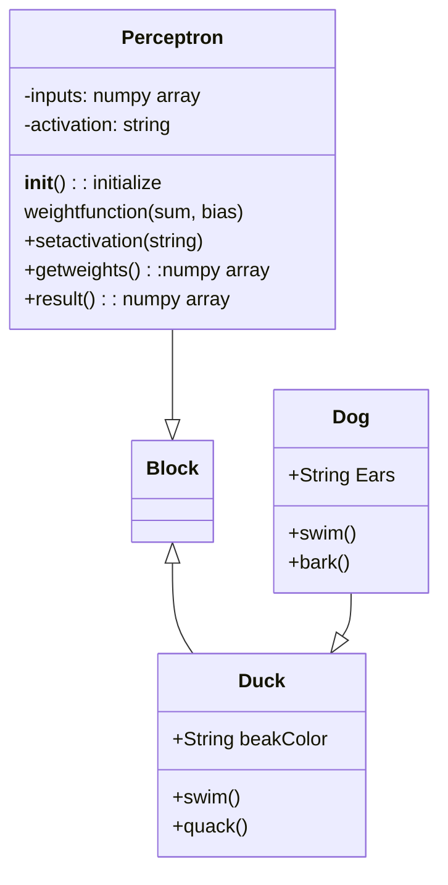

```mermaid
classDiagram
    class Perceptron{
     -inputs: numpy array
     -activation: string 
     __init__(): initialize
    weightfunction(sum, bias)
     +setactivation(string)
     +getweights():numpy array
     +result(): numpy array
     }
class Duck{
    +String beakColor
    +swim()
    +quack()
    }
class Dog{
    +String Ears
    +swim()
    +bark()
    }    
Block <|-- Duck
Dog --|> Duck
Perceptron --|>Block
```